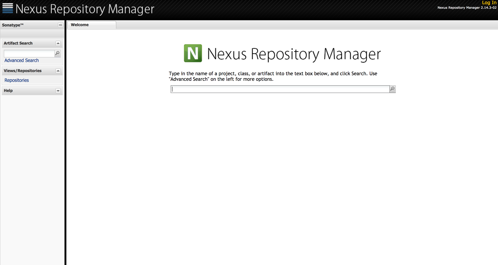
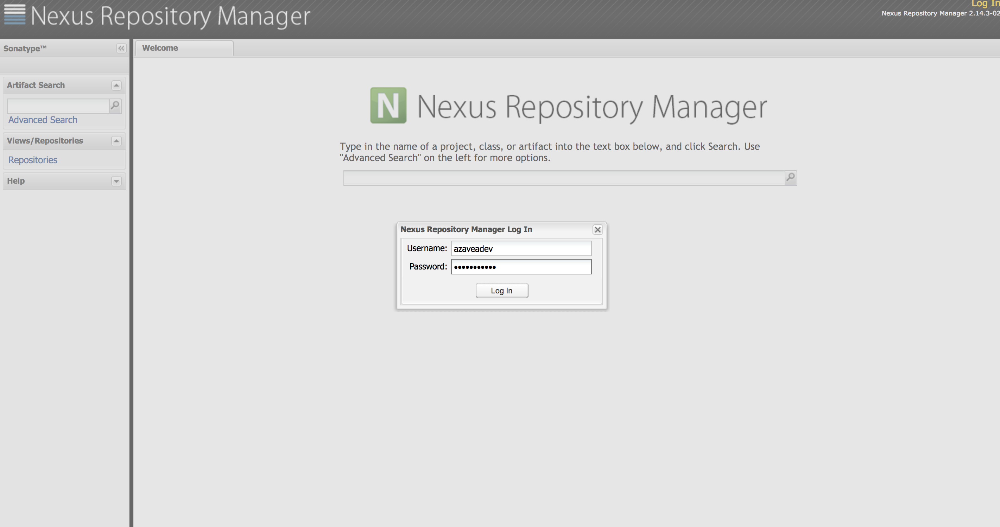
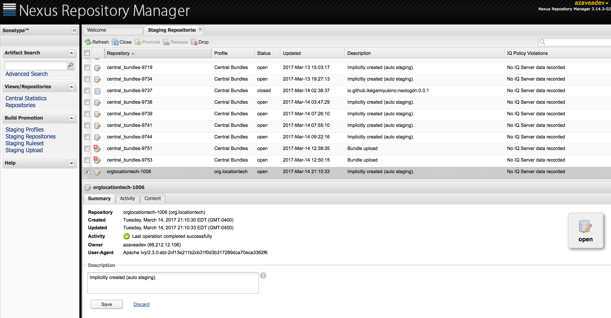
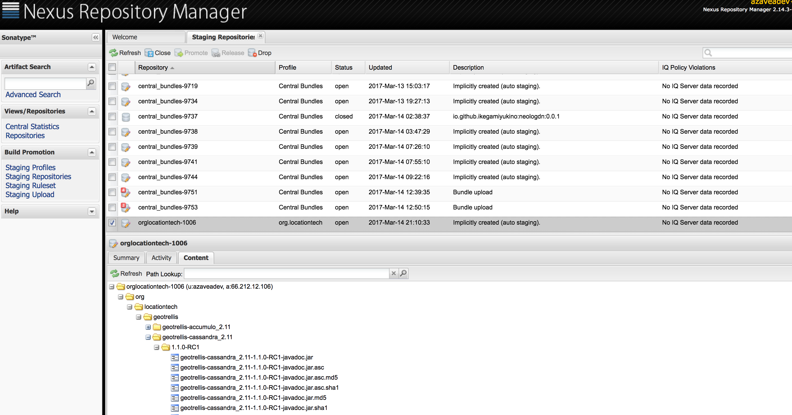
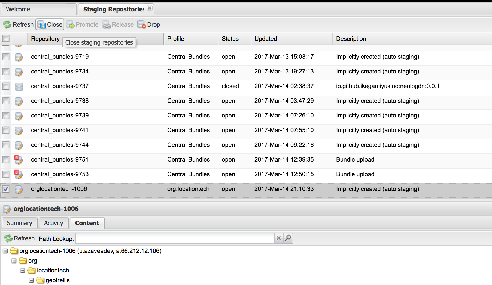
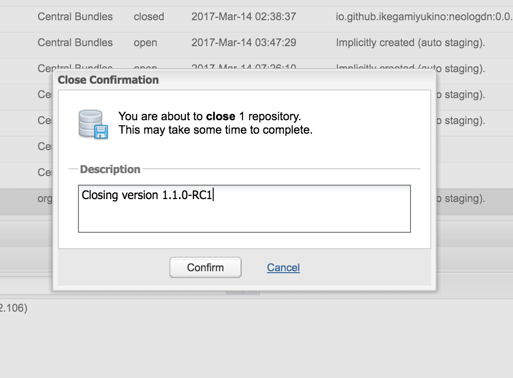
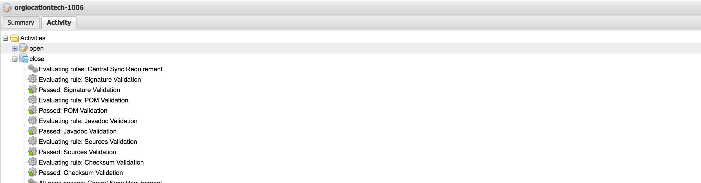
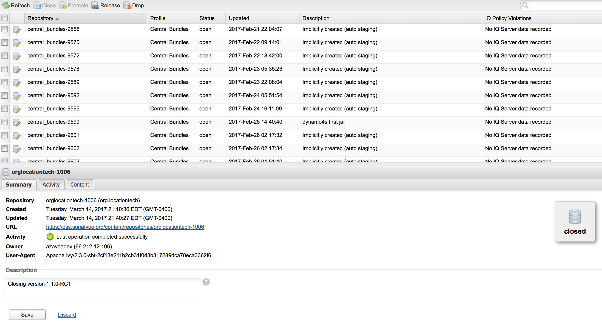
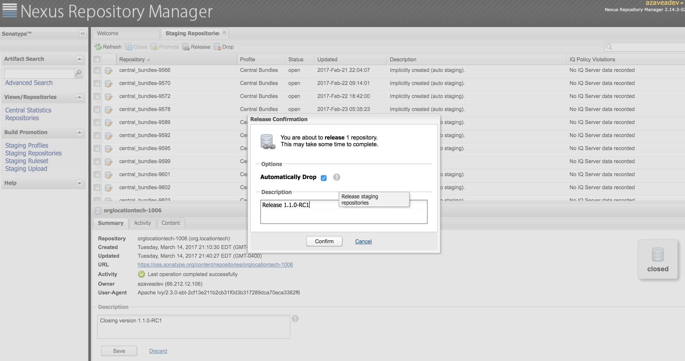

# Releasing 1.1

This is a write up of how I went about releasing 1.1.

## Prequel

First of all, I _thought_ I was releasing 1.0.1, a bugfix version. However, there was changes that we wanted to encorporate that added features, and according to [semver](http://semver.org/), that requires a minor release version increment. We recently (as of 1.0) decided to try and stick to semver as strictly as possible, so 1.1 it was. That however wasn't the last of the semver woes, which we'll see later.

## Step 1: Figure out what's going into the release

It's common for issues and PRs not to be labelled with a version milestone when they are submitted or reviewed. If we improved our processes for setting that type of information earlier, we could speed up this part.

I went through all the open issues and placed them into labeled them with a version milestone if they were not labelled, fixed the label if needed (e.g. if we thought we would include something in 1.1 but it was being kicked to 1.2), or confirmed that the label was correct. In this process, I discovered a number of issues I hadn't seen before, or needed responses. It was clear that this issue backog culling process should happen more often. I ended up closing a bunch of issues that were either stale or had been fixed by PRs that were not properly labeled (which [closes the related issue automatically](https://github.com/blog/1506-closing-issues-via-pull-requests)). I also created an `ongoing` milestone to account for issues such as the one discussing the roadmap.

I then went through all the PRs that were either open or merged after the `1.0` branch was created, and labeled them with a version milestone.

In this process, I found [this PR](https://github.com/locationtech/geotrellis/pull/1874), which had suprisingly been merged into master after the 1.0 branch was created, but not backported.

### Aside: Backporting

The process that I've used to maintain a release branch is to backport changes that apply to the release after the branch has been made. For example, I had [backported](https://github.com/locationtech/geotrellis/pull/1879) a [change](https://github.com/locationtech/geotrellis/pull/1865) that James made, moving his changes into the 1.0 branch.

I do backports by `git cherry-pick`ing each commit of the PR one at a time into a local branch I made off of the 1.0 branch. Sometimes that process ends up with conflicts, and so during the backport I need to "Be Careful" and get the conflict resolution correct. I'll then mark the commit with an indication that there was a merge conflict, ideally with the conflicting files (see [this backport PR](https://github.com/locationtech/geotrellis/pull/1923), specificall [this commit message](https://github.com/locationtech/geotrellis/pull/1923/commits/8b3bd6a5645ef7de039f7e38175528599ba41007) for an example).

### Back to the narrative...

So, I had not backported #1874. This was unfortunate, and shows that my process is not the best at ensuring nothing gets lost. Not only that, but the PR contains breaking API changes. Nothing too dramatic, just some capitilization changes to some public method names; however, if we want to be strict about semver, that means the next release should be 2.0. For a project that lived for almost 6 years without a 1.0, that prospect seems egregious to me.

What's more, a [small change](https://github.com/locationtech/geotrellis/pull/1919) that wasn't slated for 1.0 is still API breaking - it moves some public types from one subproject to another.

I marked them with a label named "api-changes", for later discussion.

There were not only PRs that either made it into 1.0 or were potentially makig it into 1.1 - we have a feature branch for pointcloud work, that is not releasing anything. Those PRs cluttered up the view, so I created a `pointcloud` milestone to account for them. That feature branch has a lot of changes, some that might not even stay in the main GeoTrellis repository (and instead be spun out into it's own separate project inside the GeoTrellis "ecosystem"), and while some of the functionality that is going to make it's way into GeoTrellis could be great for 1.1, I'm choosing to push that to 1.2.

There were a lot of unlabelled PRs, so it took quite a while to get through them all.

After all issues were reviewed and labelled, and all PRs are labelled, now it's a matter of closing out the open issues and merging the open PRs!

There are 3 open PRs and 9 open issues. This usually happens, at the last minute there's some relatively easy issues that have gone unresolved, but should be resolved and included in the release; so it's up to you to do them (or if you've planned better, you've assigned them out ahead of time).

### Finishing the release

There's usually a flurry of activity, for things that should go in the release. This happens for issues that seem like they need to make it into the release, but also for changes people want to get into the release. For 1.1, there were a number of issues fixed, one PR that included some new API that needed to be deliberated on, and some last minute PRs. This ends up pushing back the release forward a couple of days. One thing that could alleviate this is having a hard code cut; however we've tried that in the past, but things like "but this small change should really go in" or "but the feature isn't done yet" happened which pushed us past the code cut date.

### Aside: CQ's

Now that we are at LocationTech, our release process gets more complicated. There's a whole process to follow for an Eclipse release, including a [Release Review](https://wiki.eclipse.org/Development_Resources/HOWTO/Release_Reviews) that is passed by the PMC and the IP team.

As a first step, because our own release process is complicated enough and we have people needed the changes included in 1.1, I'm going to publish 1.1.0-RC1 - a release candidate. For PRs that I know add dependencies that I'll have to [make CQs for](https://wiki.eclipse.org/Development_Resources/Contribution_Questionnaire), I'll mark with "needs-cqs" so that I can worry about them later.

### Aside: Release Candidate

As part of our release process, we release a RC version to maven central for people to use and test. If any problems are found with the RC, we fix it and publish an new one; I'll first publish `1.1.0-RC1` and if any bugs need fixing I'll publish `1.1.0-RC2`.

When we release the RC, we encourage members of the community to test it and try to break it. This has been really great for us; many issues with 0.10 were reported from the community and fixed before the final release due to this process.

We usually wait on an RC for about a week or two before considering it good to be released; if everything is quite and no one brings up additional issues in that time we push the final release.

### Back to the narrative...

Once all the issues were solved and PRs merged, I cut the 1.1 branch. This is really just a matter of `git checkout -b 1.1` off of master. I commit a change to the version number, to make it `1.1.0-RC1`, and then push that branch up to the upstream repo.

```
git checkout master
# Just to be safe I don't have anything weird in master, reset hard to upstream
git reset --hard upstream/master
git checkout -b 1.1
# ... Change version, commit ...
git push upstream 1.1
git tag -s -a v1.1.0-RC1 -m "Version 1.1.0-RC1"
git push upstream v1.1.0-RC1
```

### Publishing to Sonatype

Now for the real fun: publishing to sonatype! We publish our artifacts to maven central, and we do so through oss.sonatype.org.

As stated in the [publish README](https://github.com/locationtech/geotrellis/blob/1.1/publish/README.md), you'll need some credentials and some files in order to publish. This is being held onto by Azavea currently; if it ever became the case that non-Azaveans were to publish, we should perhaps move this stuff to somewhere external (probably the Eclipse Foundation).

I need to modify the version in the Dockerfile to 1.1.0-RC1, and then run through the steps described in the README.

Once that process finishes (it takes a while), go to `oss.sonatype.org`.



Then login



Go to "Staging repositories". You should see the repo for the artifacts you just published via SBT at the bottom of the list. If you don't see it, something has messed up. I don't know what all those other entries are.



If you go to the "Content" tab, you should see the list of artifacts. Verify that they are all there.



Now hit the "close button" towards the top:



It's a weird name, but "closing" a staging repository means getting it ready to release. This is opposed to "dropping" a repo, which will remove it and all the artifacts.

Confirm the closing



Now it's in "closing mode" or something. If you look at the activity you can see a bunch of stuff underway:



This is where it will fail if the artifacts are not signed properly.

After it passes you see a fun green check and the "release" button activates:



Now it's release time.



That's it! Your artifacts will be ready to pull in a bit, and it'll take a while for your artifacts to be visible to something like [search.maven.org](http://search.maven.org). But the release candidate (in this case, 1.1.0-RC1) is released. Booyah! :tada:
